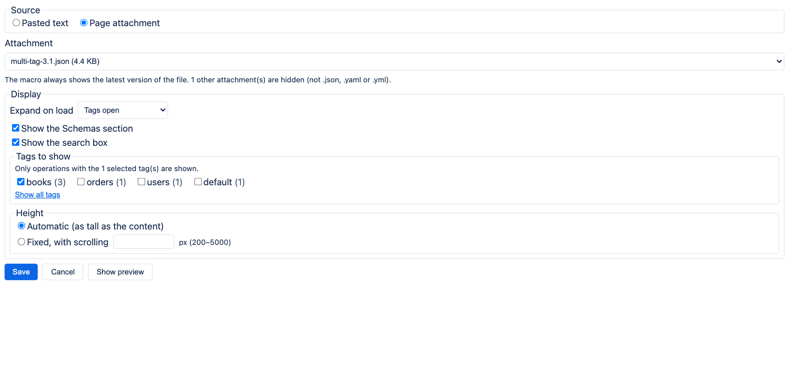
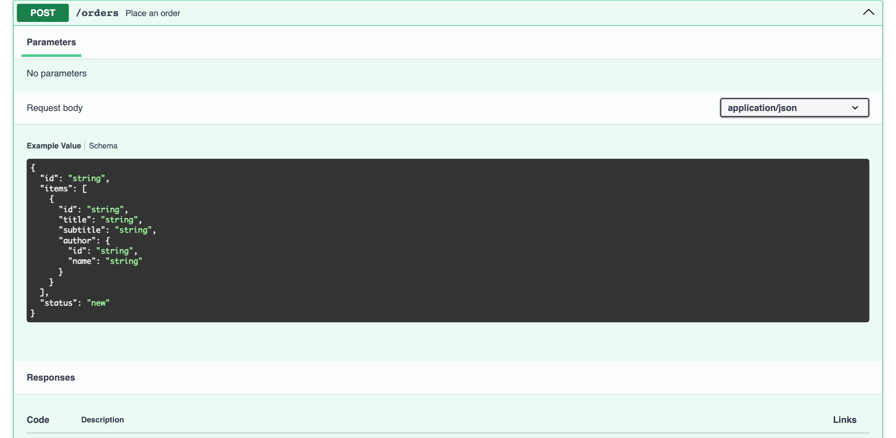
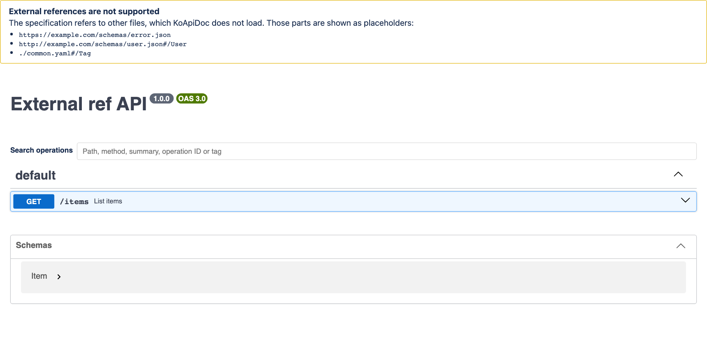
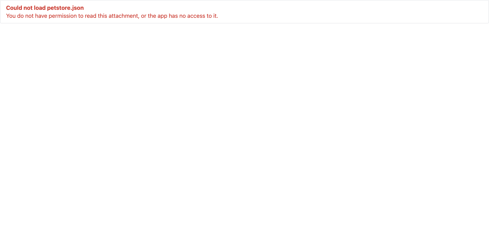

# KoApiDoc for Confluence: user guide

KoApiDoc is a Confluence Cloud macro that shows an OpenAPI or Swagger specification as a
read-only, browsable API reference on a page. The specification is either pasted into the macro
or read from a `.json`, `.yaml` or `.yml` file attached to the same page.

- [What it supports](#what-it-supports)
- [Installation](#installation)
- [Add the macro to a page](#add-the-macro-to-a-page)
- [Choose the source](#choose-the-source)
- [Display options](#display-options)
- [Reading the documentation](#reading-the-documentation)
- [Permissions and data](#permissions-and-data)
- [Limitations](#limitations)
- [Troubleshooting](#troubleshooting)
- [Support](#support)

## What it supports

| | |
| --- | --- |
| Specification versions | Swagger 2.0, OpenAPI 3.0.x, OpenAPI 3.1.x |
| Formats | JSON and YAML (UTF-8) |
| Sources | text pasted into the macro, or an attachment of the same page |
| Attachment size | up to 2 MB |
| Themes | follows the Confluence light and dark theme |

The macro is read-only: it shows operations, parameters, request bodies, responses, examples and
schemas. It does not send requests to your API (there is no "Try it out" button).

## Installation

A Confluence site administrator installs KoApiDoc from the Atlassian Marketplace: in Confluence,
open the apps menu, search the Marketplace for **KoApiDoc** and choose to get the app. The menu
names can differ slightly between Confluence versions.

During installation Confluence asks the administrator to allow two read-only permissions, both
used to read attachments of the page that contains the macro (see
[Permissions and data](#permissions-and-data)). KoApiDoc is free and has no settings of its own.

## Add the macro to a page

1. Edit the page.
2. Type `/` and search for **KoApiDoc**, then select it.
3. The configuration opens. Choose the source and the display options, then select **Save**.
4. Publish or update the page.

To change the macro later, edit the page, select the macro and use its edit (pencil) button.

## Choose the source

**Pasted text.** Paste the whole specification (JSON or YAML) into the text box. Below the box
KoApiDoc tells you right away whether it is a valid Swagger 2.0 / OpenAPI 3.x document. You can
save an invalid document, but the page then shows the error instead of the documentation. The
pasted text is stored in the macro, as part of the page.

**Page attachment.** Attach the specification file to the page first (for example by dragging it
into the editor or through the page's attachments), then choose **Page attachment** in the
configuration and pick the file from the list. Only `.json`, `.yaml` and `.yml` files are listed;
the configuration tells you how many other attachments are hidden.

- The macro always shows the **latest version** of the attachment. To update the documentation,
  upload a new version of the same file; readers see it the next time they load the page.
- The list is available once the page has been saved at least once.
- If the attachment is deleted or moved to another page, the macro shows an error, and the
  configuration marks the saved file as "not found" so you can choose another one.

## Display options

| Option | What it does | Default |
| --- | --- | --- |
| Expand on load | everything collapsed, tags open, or everything open (all operations expanded) | tags open |
| Show the Schemas section | shows or hides the list of schemas (models) below the operations | shown |
| Show the search box | a search field above the operations | shown |
| Tags to show | only operations with the selected tags are shown; none selected means all | all |
| Height | automatic (as tall as the content), or fixed between 200 and 5000 px with scrolling inside the macro | automatic |

Operations without a tag are grouped under **default**, as in Swagger UI, and can be selected
like any other tag. For specifications with more than 1000 operations the configuration suggests
choosing tags, which keeps the page easier to read. If a selected tag later disappears from the
specification (for example because it was renamed), readers see a short note and the
configuration lists the tag as "not in the specification" so you can remove it.

**Show preview** in the configuration renders the documentation with the current options below
the form, and follows every change you make.

## Reading the documentation

- Select an operation to expand it and see its parameters, request body, responses and examples.
- The search box matches the path, the HTTP method, the summary, the operation ID and the tag.
  Several words narrow the result (all words must match); upper and lower case do not matter.
- With a fixed height, the macro scrolls on its own. With the keyboard, move the focus to the
  documentation area (Tab) and scroll with the arrow keys.

## Permissions and data

- KoApiDoc reads attachments **as the person viewing the page**. Someone who cannot see the
  attachment sees an error message instead of the documentation, never its content.
- It only reads attachments of the page that contains the macro, and only reads; it never
  changes or creates content.
- The specification is processed in the reader's browser. KoApiDoc has no server of its own,
  stores nothing outside Confluence and sends no data to the developer or to third parties.
- A pasted specification is stored in the page (in the macro), so it is visible to everyone who
  can edit the page and is kept in the page history.

Details: [privacy policy](PRIVACY.md).

## Limitations

- **No "Try it out".** Requests to your API cannot be sent from the page.
- **External references are not loaded.** A `$ref` that points to another file or URL (for
  example `common.yaml#/Error` or `https://example.com/schemas/user.json`) is replaced by a
  placeholder, and a note above the documentation lists those references. References inside the
  document (`#/components/...`, `#/definitions/...`) work. Bundle multi-file specifications into a
  single file before attaching them.

  

- **Remote images are not shown.** Images in descriptions that point to a web address are
  blocked, so that opening a page never contacts other servers. Embedded (`data:`) images work.
- **2 MB limit** for attachments. Larger files show an error; select some tags or split the
  specification. Confluence may limit the size of a macro's configuration, so use an
  attachment for large specifications instead of pasting them.
- **PDF and Word export, and printing.** Confluence's exports do not run app macros, so the
  documentation is missing from exported or printed pages.
- **Same page only.** Attachments of other pages cannot be selected; attach the file to the page
  that shows it.
- **One specification per macro.** Use several macros to show several specifications.

## Troubleshooting

| Message | What to do |
| --- | --- |
| No specification yet | Edit the macro and paste a specification or choose an attachment. |
| Invalid specification | The text is not valid JSON / YAML, the `openapi` / `swagger` field is missing or unsupported, or a YAML document expands to too many values through nested anchors and aliases (`*name`). The message points to the first problem the parser found. |
| The specification could not be displayed | The document was read, but its structure is not valid OpenAPI (for example a path that does not map to an object of operations). Check the document with an OpenAPI validator. |
| Could not load *file*: You do not have permission… | You cannot view this attachment, or the app was not allowed to read it. Ask the page owner or a site administrator. |
| Could not load *file*: The attachment was not found… | The file was deleted or moved. Edit the macro and choose another attachment. |
| …larger than the 2.0 MB limit | Reduce the file (or show it in parts). |
| …is not a text file | The attachment is not UTF-8 text. Save the specification as UTF-8 JSON or YAML. |
| Confluence did not respond in time | Reload the page. If it keeps happening, report it (see below). |
| Some selected tags are not in the specification | Edit the macro and update the tag selection. |
| No operations to show | None of the operations has one of the selected tags. Choose other tags or **Show all tags**. |

## Support

Report bugs and ideas in the [issue tracker](https://github.com/HunKonTech/KoApiDoc/issues).
Issues are public: do not post confidential specifications; reduce the problem to a small,
anonymised example. Security problems: see [SECURITY.md](../SECURITY.md).

KoApiDoc is an independent product. Atlassian and Confluence are trademarks of Atlassian Pty Ltd.
OpenAPI is a trademark of The Linux Foundation. Swagger is a trademark of SmartBear Software.
KoApiDoc is not affiliated with, endorsed or sponsored by them. It uses the open-source Swagger UI
library (Apache-2.0); see [THIRD_PARTY_NOTICES](../THIRD_PARTY_NOTICES).
