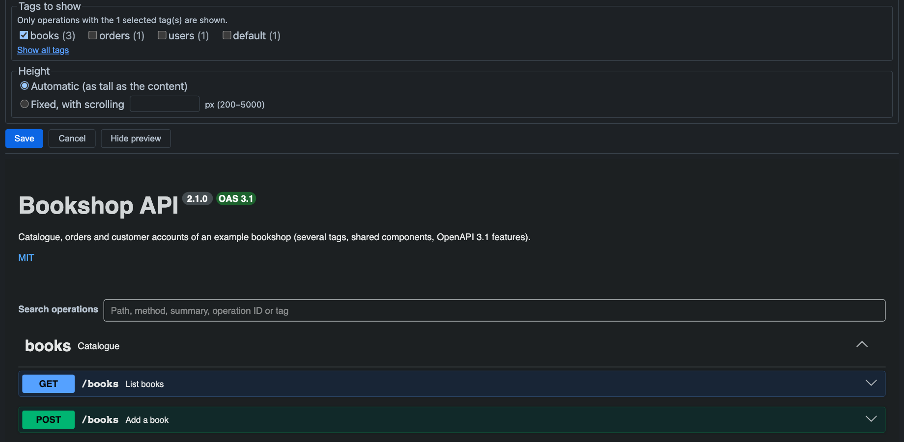
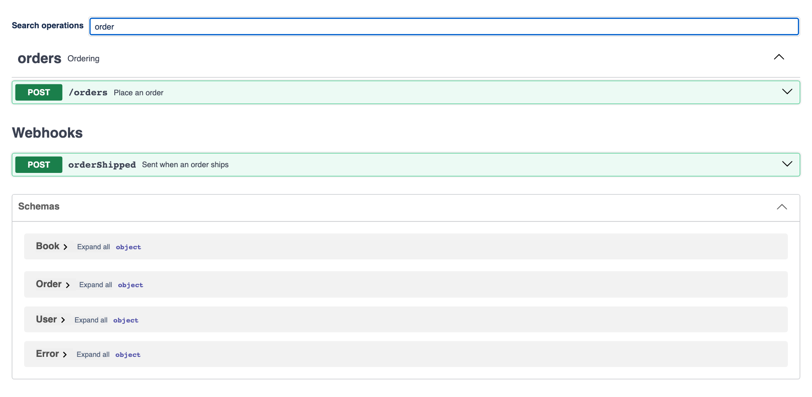

# Configuration

## Source

- **Pasted text**: paste the whole specification (JSON or YAML). A validity hint appears below the box. The text is stored in the page.
- **Page attachment**: pick a `.json`, `.yaml` or `.yml` attachment of the same page. The latest version is always shown. The list is available once the page has been saved.

## Display options

| Option | Effect | Default |
| --- | --- | --- |
| Expand on load | collapsed, tags open, or all operations open | tags open |
| Show the Schemas section | list of schemas below the operations | shown |
| Show the search box | search field above the operations | shown |
| Tags to show | only operations with the selected tags; none selected = all | all |
| Height | automatic, or fixed 200 to 5000 px with inner scrolling | automatic |

Untagged operations are grouped under **default**. **Show preview** renders the documentation with the current options.

## Reading

Select an operation to expand it. Search matches path, method, summary, operation ID and tag; several words must all match.

