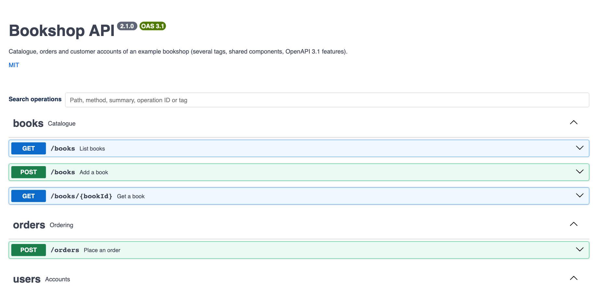

# KoApiDoc for Confluence

KoApiDoc is a Confluence Cloud macro that shows an OpenAPI or Swagger specification as a read-only, searchable API reference on a page. Paste the spec into the macro, or attach the JSON/YAML file to the page.

## Start here

- [[Getting Started]]: install and add the macro
- [[Configuration]]: source and display options
- [[Supported Specifications]]: formats, versions, limits
- [[Security and Privacy]]: permissions and data handling
- [[Limitations]] and [[Troubleshooting]]
- [[FAQ]]
- [[Development]]: where the source lives and how to give feedback
- [[License and Contributing]]

## Status

Not yet published on the Atlassian Marketplace. Project page: <https://github.com/HunKonTech/KoApiDoc>
